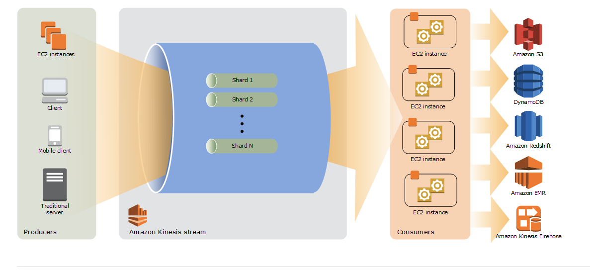

# For Blog Post

# Tutorial Overview

This tutorial will go over Kinesis, Lambda, SQS, and instructions on how to setup a simple application connecting the 3.

### What is a Lambda?

AWS Lambda lets you run code __without provisioning or managing servers__. You pay only for the compute time you consume. You pay only for the compute time you consume - there is no charge when your code is not running. With Lambda, you can run code for virtually any type of application or backend service - all with zero administration. Just upload your code and Lambda takes care of everything required to run and scale your code with high availability. You can set up your code to automatically trigger from other AWS services or call it directly from any web or mobile app.

### Why use a Lambda?

Serverless (a misnomer clearly) computing allows you to build and run applications and services without thinking about servers. With serverless computing, your application __still runs on servers__ (so this really should be called ephemeral server computing or No-server-management server computing), __but all the server management is done by AWS__. At the core of serverless computing is AWS Lambda, which lets you run your code without provisioning or managing servers.

AWS Lambda makes it easy to execute code in response to __events__, such as changes to Amazon S3 buckets, new Kinesis messages in the stream, updates to an Amazon DynamoDB table, or custom events generated by your applications or devices. With Lambda you do not have to provision your own instances; Lambda performs all the operational and administrative activities on your behalf, including capacity provisioning, monitoring fleet health, applying security patches to the underlying compute resources, deploying your code, running a web service front end, and monitoring and logging your code

What kind of code can you run on Lambda? You can use AWS Lambda to build back-ends that retrieve and transform data from Amazon DynamoDB or Kinesis, ETL pipelines that retrieve data from Kinesis streams and send them to AWS SQS queues, handlers that compress or transform objects as they are uploaded to Amazon S3. Lambdas can even respond to HTTP requests and act as web servers. Anything code can do, Lambdas can do.

Can you manage the servers that Lambda runs on? No. AWS Lambda operates the compute infrastructure on your behalf, allowing it to perform health checks, apply security patches, and do other routine maintenance.

Where is the code? AWS Lambda stores code in Amazon S3 and encrypts it at rest. AWS Lambda performs additional integrity checks while your code is in use.

Limitations and gotchas? The code must be written in a “stateless” style i.e. it should assume there is no affinity to the underlying compute infrastructure. Local file system access, child processes, and similar artifacts may not extend beyond the lifetime of the request, and any persistent state should be stored in Amazon S3, Amazon DynamoDB, or another Internet-available storage service.

Why stateless? Keeping functions stateless enables AWS Lambda to rapidly launch as many copies of the function as needed to scale to the rate of incoming events. While AWS Lambda’s programming model is stateless, your code can access stateful data by calling other web services, such as Amazon S3 or Amazon DynamoDB.

Can you use threads and processess like in a normal server? Yes. AWS Lambda allows you to use normal language and operating system features, such as creating additional threads and processes. Resources allocated to the Lambda function, including memory, execution time, disk, and network use, must be shared among all the threads/processes it uses. You can launch processes using any language supported by Amazon Linux.

### What is Kinesis (Kinesis Data Streams)?

Amazon Kinesis Data Streams is a data store that enables you to build custom applications that process or analyze streaming data for specialized needs. You can continuously add various types of data such as clickstreams, application logs, and social media to an Amazon Kinesis data stream from __hundreds of thousands of sources__. 

### What is a stream?
 
A Kinesis data stream is a set of shards. What is a shard? A shard is a uniquely identified sequence of data records in a stream. Each shard has a sequence of data records. Each data record has a sequence number that is assigned by Kinesis Data Streams. None of this involves different hard disk space or other hard resources... they are simply ways in which Kinesis identifies messages within itself.

 There can be multiple applications for one stream, and each application can consume data from the stream independently and concurrently.
 
 ### How does sharding work?
 
 
 So, a shard has two purposes:

A certain amount of capacity/throughput
An ordered list of messages
If your application must process all messages in order, then you can only use one shard. Think of it as a line at a bank — if there is one line, then everybody gets served in order.

 However, if messages only need to be ordered for a certain subnet of messages, they can be sent to separate shards. For example, multiple lines in a bank, where each line gets served in order. Or, think of a bus sending GPS coordinates. Each bus sends messages to only a single shard. A shard might contain messages from multiple buses, but each bus only sends to one shard. This way, when the messages from that shard is processed, all messages from a particular bus are processed in order.

This is controlled by using a Partition Key, which identifies the source. The partition key is hashed and assigned to a shard. Thus, all messages with the same partition key will go to the same shard.

At the back-end, there is a typically one worker per shard that is processing the messages, in order, from that shard.

If your system does not care about preserving message order, then use a random partition key. This means the message will be sent to any shard.

### Come again? How do partition keys fit into this?

Partition keys only matter when you have multiple shards in a stream (but they're required always). Kinesis computes the MD5 hash of a partition key to decide what shard to store the record on (if you describe the stream you'll see the hash range as part of the shard decription).

So why does this matter?

Each shard can only accept 1,000 records and/or 1 MB per second (see PutRecord doc). If you write to a single shard faster than this rate you'll get a ProvisionedThroughputExceededException.

With multiple shards, you scale this limit: 4 shards gives you 4,000 records and/or 4 MB per second. Of course, there are caveats.

The biggest is that you must use different partition keys. If all of your records use the same partition key then you're still writing to a single shard, because they'll all have the same hash value. How you solve this depends on your application: if you're writing from multiple processes then it might be sufficient to use the process ID, server's IP address, or hostname. 

### How does Kinesis separate messages into different shards? 
To reiterate, Kinesis Data Streams segregates the data records belonging to a stream into multiple shards. It separates messages into different shards using a partition key; it is used to determine which shard a given data record belongs to. Partition keys are simply Unicode strings with a maximum length limit of 256 bytes.  

Each data record has a sequence number that is unique per partition-key within its shard. By extension, each sequence number is unique per shard.

If you have multiple applications that are reading records from the same stream, you can use Kinesis stream consumers instead of standard iterators. Consumers have dedicated read throughput so they don't have to compete with other consumers of the same data. With consumers, Kinesis pushes records to Lambda over an HTTP/2 connection, which can also reduce latency between adding a record and function invocation.

Ability for multiple applications to consume the same stream concurrently. For example, you have one application that updates a real-time dashboard and another that archives data to Amazon Redshift. You want both applications to consume data from the same stream concurrently and independently.

replayable queue, and SQS is not. Ability to consume records in the same order a few hours later. For example, you have a billing application and an audit application that runs a few hours behind the billing application. Because Amazon Kinesis Streams stores data for up to 7 days, you can run the audit application up to 7 days behind the billing application.

Architecture example:

### What are some key advantages of Kinesis over say a normal message queue like SQS?

There are 2 main advantages for Kinesis:

- you can read the same message from several applications
- you can re-read messages in case you need to.

Kinesis support multiple consumers capabilities that means same data records can be processed at a same time or different time within 24 hrs at different consumers, similar behavior in SQS can be achieved by writing into multiple queues and consumers can read from multiple queues.

Second, Kinesis provides routing capability to selective route data records to different shards using partition key1

### How are messages on Kinesis ordered?

Kinesis's order guarantee is per-shard, not per-stream. Once you have more than one shards, the whole stream would have no guarantee on order.

### Why use a Lambda with Kinesis?

You can use an AWS Lambda function to process records in an Amazon Kinesis data stream. With Kinesis, you can collect data from many sources and process them with multiple consumers. Lambda reads records from the Kinesis data stream and invokes your function synchronously with an event that contains stream records. Lambda reads records in batches and invokes your function to process records from the batch.

By default, Lambda invokes your function as soon as records are available in the stream. If the batch it reads from the stream only has one record in it, Lambda only sends one record to the function. To avoid invoking the function with a small number of records, you can tell the event source to buffer records for up to 5 minutes by configuring a batch window. Before invoking the function, Lambda continues to read records from the stream until it has gathered a full batch, or until the batch window expires.

### What is SQS?

Amazon Simple Queue Service (Amazon SQS) offers a reliable, highly scalable hosted queue for storing messages as they travel between computers. Amazon SQS lets you easily move data between distributed application components and helps you build applications in which messages are processed independently (with message-level ack/fail semantics), such as automated workflows.